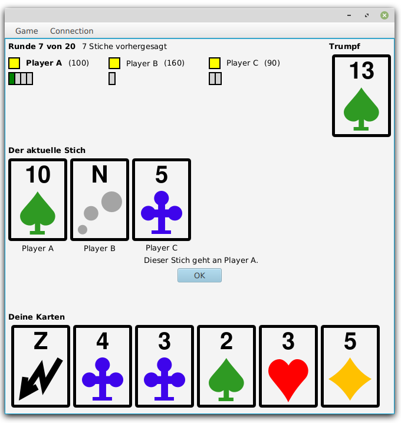

# Zauberer

A multi player online variant of the famous card game "Wizard" by Ken Fisher.

For a description of the game, see https://boardgamegeek.com/boardgame/1465/wizard.

## Project structure

The project is structured in three modules, `client`, `server` and `common`. The `client` module contains a JavaFX 
application that is run on a players local machine. The `server` module has no user interface. It must be started on
an arbitrary machine, where all client can connect to. The `common` module contains the classes implementing the game
protocol that is required from the `client` and `server` code. 

## Build

Run 

```
mvn clean install
```

in this directory. If the build succeeds, it produces a runnable JAR for the server in 
`server/target/wizard-version-full.jar` and both a runnable JAR and a Windows EXE for the Wizard client application in 
`client/target`.

## Usage

Start the server on some machine and the clients on at least three machines for the players. From each client connect
to the game server. One of the clients is then expected to create a game. The other clients join the created game. After
all players have joined, the game can be started. Follow the instructions in the UI.
 
